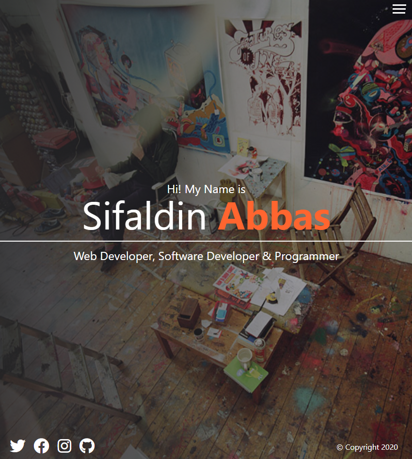
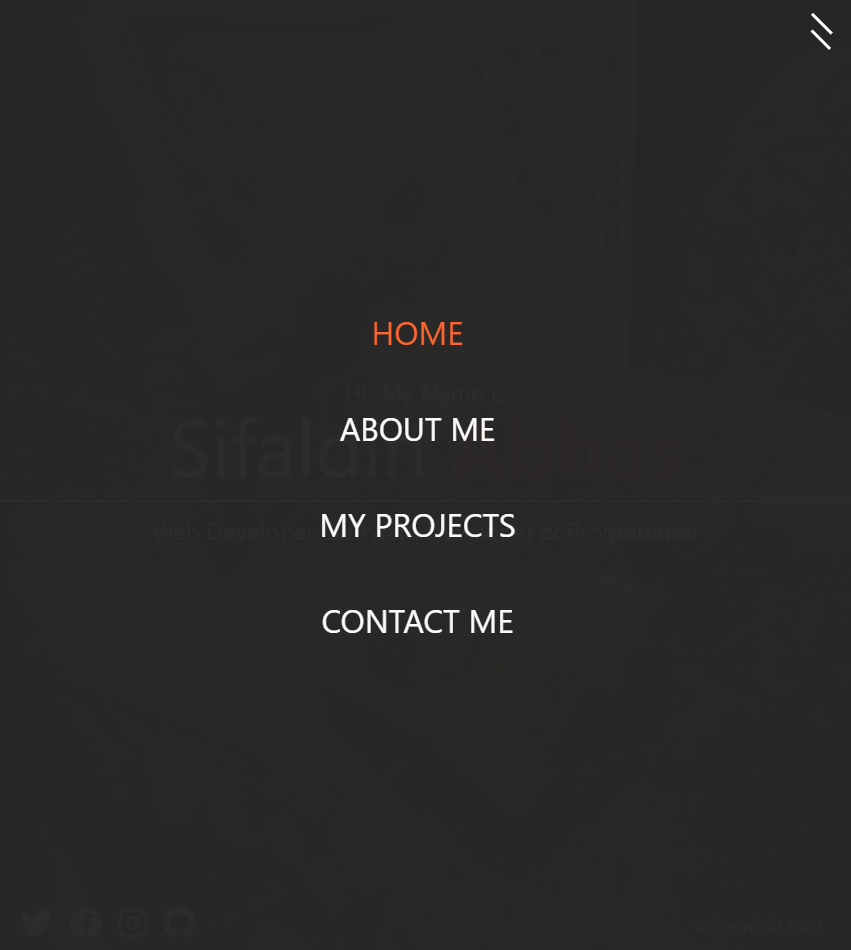
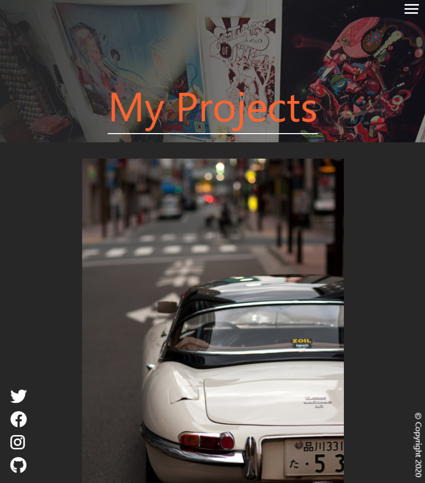
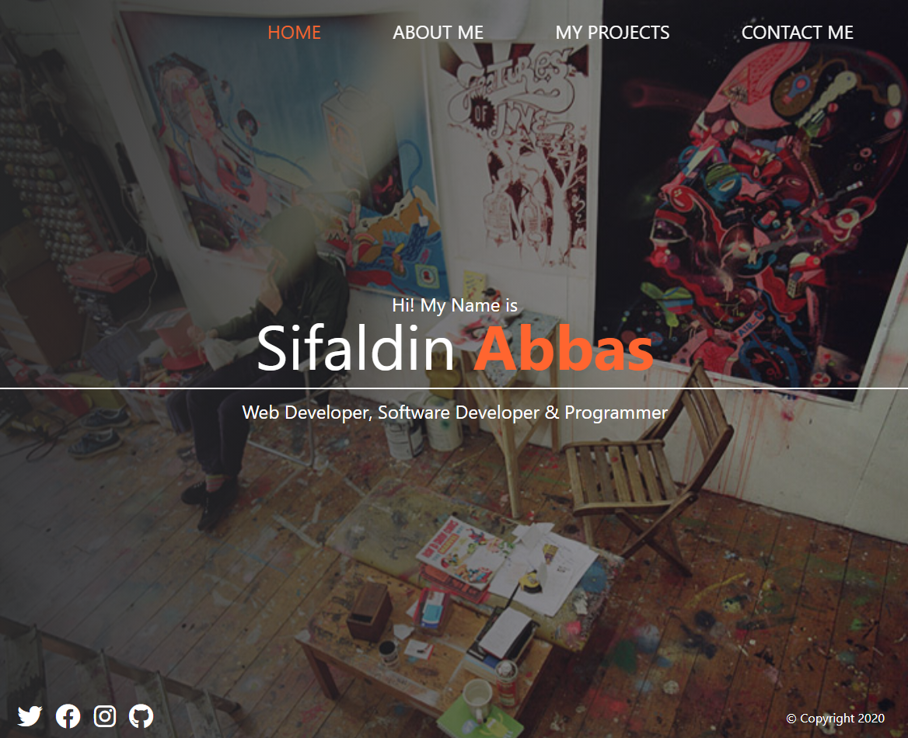
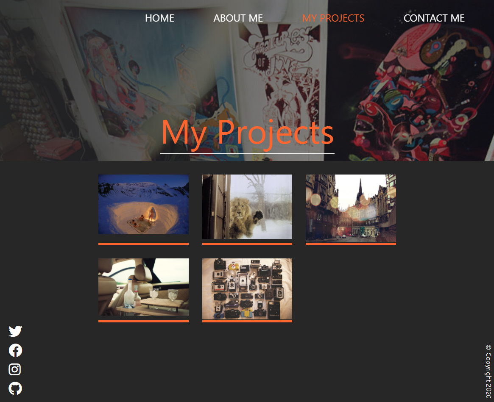

# THIS IS FOR TRAINING PURPOSES SO NO ATTENTION WAS PAID TO BRANCHES AND COMMITS IN CASE THEY LOOK HORRIBLE OR THEY LACK IN THE NUMBER OF BRANCHES/COMMITS

# SCSS Mixin, Maps, Functions, For loops, Compiling, Variables, Nesting, Extending, Partials, Grid, Flexbox & Math Operations
 

## the name is pretty self-explanatory, a great portfolio template. 
## designed mobile first, with a drop down menu and some minor animation going on.

 

# Mobile 

 

# Desktop

